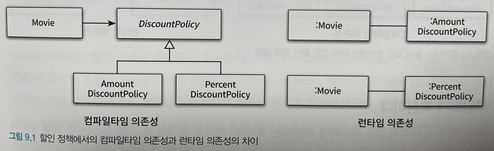
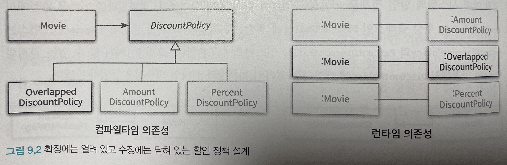

### 유연한 설계
#### 개방-폐쇄 원칙
- 확장에 대해 열려 있어야 하고, 수정에 대해서는 닫혀 있어야 한다.
    - 확장에 대해 열려 있다 : 애플리케이션의 요구사항이 변경될 때 이 변경에 맞게 새로운 '동작'을 추가해서 애플리케이션의 기능을 확장할 수 있다.
    - 수정에 대해 닫혀 있다 : 기존의 '코드'를 수정하지 않고도 애플리케이션의 동작을 추가하거나 변경할 수 있다.

-> 기존 코드를 수정하지 않고도 애플리케이션의 동작을 확장할 수 있는 설계

##### 컴파일타임 의존성을 고정시키고 런타임 의존성을 변경하라
- 런타임 의존성 : 실행시에 협력에 참여하는 객체들 사이의 관계
- 컴파일타임 의존성 : 코드에서 드러나는 클래스들 사이의 관계



위 그림에서
- 컴파일 의존성 관점 : Movie 클래스는 추상 클래스인 DiscountPolicy에 의존
- 런타임 의존성 관점 : Movie 인스턴스는 AmountDiscountPolicy와 PercentDiscountPolicy에 의존



위 그림은 중복 할인 정책을 구현하는 OverlappedDiscountPolicy 클래스 추가

개방-폐쇄 원칙을 따르는 설계란 컴파일타임 의존성은 유지하면서 런타임 의존성의 가능성을 확장하고 수정할 수 있는 구조

##### 추상화가 핵심이다
개방-폐쇄 원칙의 핵심은 추상화에 의존하는 것

```java
import java.util.ArrayList;
import java.util.Arrays;
import java.util.List;

public abstract class DiscountPolicy {
  private List<DiscountCondition> conditions = new ArrayList<>();

  public DiscountPolicy(DiscountCondition... conditions) {
    this.conditions = Arrays.asList(conditions);
  }
  
  public Money calculateDiscountAmount(Screening screening) {
      for (DiscountCondition each : conditions) {
          if (each.isSatisfiedBy(screening)) {
              return getDiscountAmount(screening);
          }
      }
      
      return screening.getMovieFee();
  }
  
  abstract protected Money getDiscountAmount(Screening screening);
}
```

- 추상화 과정을 통해 생략된 부분은 할인 요금 계산
- 상속을 통해 생략된 부분을 구체화함으로써 할인 정책을 확장

```java
public class Movie {
  ...
  private DiscountPolicy discountPolicy;
  
  public Movie(String title, Duration ruuningTime, Money fee, DiscountPolicy discountPolicy) {
    ...
    this.discountPolicy = discountPolicy;
  }
  
  public Money calculateMovieFee(Screening screening) {
      return fee.minus(discountPolicy.calculateDiscountAmount(screening));
  }
}
```

- 할인 정책을 추상화한 DiscountPolicy에만 의존
- DiscountPolicy의 자식 클래스를 추가하더라도 영향을 받지 않음

- 변하는 것과 변하지 않는 것이 무엇인지 이해하고, 이를 추상화의 목적으로 삼아야 한다.
- 변경되지 않을 부분을 신중하게 결정하고 올바른 추상화를 주의 깊게 선택했기 때문이라는 사실 기억

#### 생성 사용 분리
- 아래 코드는 추가하거나 변경하기 위해 기존 코드를 수정하도록 만들기 때문에 개방-폐쇄 원칙을 위반한다.
```java
public class Movie {
  ...
  private DiscountPolicy discountPolicy;
  
  public Movie(String title, Duration runningTime, Money fee) {
    ...
    this.discountPolicy = new AmountDiscountPolicy(...);
  }
  
  public Money calculateMovieFee(Screening screening) {
      return fee.minus(discountPolicy.calculateDiscountAmount(screening));
  }
}
```
- 결합도가 높아질수록 개방-폐쇄 원칙을 따르는 구조를 설계하기가 어려워진다.
- 문제는 객체 생성이 아니라, 부적절한 곳에서 객체를 생성한다는 것이 문제다.

문제점
- 메시지를 전송하지 않고 객체를 생성하기만 한다면 아무런 문제가 없다.
- 또는 객체를 생성하지 않고 메시지를 전송하기만 했다면 괜찮았을 것이다.
- 문제는 동일한 클래스 안에서 객체 생성과 사용이라는 두 가지 목적을 가진 코드의 공존이다.

객체에 대한 생성과 사용을 분리해야 한다.

보편적인 방법
- 객체 생성 책임을 클라이언트로 옮김

##### FACTORY 추가하기
FACTORY : 생성과 사용을 분리하기 위해 객체 생성에 특화된 객체

```java
import java.time.Duration;

public class Factory {
  public Movie createAvatarMovie() {
    return new Movie("아바타",
            Duration.ofMinutes(120),
            Money.wons(10000),
            new AmountDiscountPolicy(...));
  }
}

public class Client {
    private Factory factory;
    
    public Client(Factory factory) {
        this.factory = factory;
    }
    
    public Money getAvatarFee() {
        Movie avatar = factory.createAvatarMovie();
        return avatar.getFee();
    }
}
```
- Client는 오직 사용과 관련된 책임만 지고 생성과 관련되 어떤 지식도 가지지 않는다.

##### 순수한 가공물에게 책임 할당하기
- 도메인 모델은 INFORMATION EXPERT를 찾기 위해 참조할 수 있는 일차적인 재료
- FACTORY를 추가한 이유는 순수하게 기술적인 결정
- 도메인 개념과 아무런 상관이 없는 가공의 객체로 이동

시스템을 객체로 분해하는 데는 크게 두 가지 방법 존재
- 표현적 분해(representational decomposition) : 도메인에 존재하는 사물 또는 개념을 표현하는 객체들을 이용해 시스템을 분해, 도메인 모델에 담겨 있는 개념과 관계를 따르며 도메인과 소프트웨어 사이의 표현적 차이를 최소화를 목적

- PURE FABRICATION
  - 책임을 할당하기 위해 창조되는 도메인과 무관한 인공적인 객체

- 어떤 행동을 추가하려고 하는데 이 행동을 책임질 마땅한 도메인 개념이 존재하지 않는다면 PURE FABRICATION을 추가하고 책임을 할당하라
- PURE FABRICATION은 표현적 분해보다는 행위적 분해에 의해 생성되는 것이 일반적

#### 의존성 주입
의존성 주입 : 사용하는 객체가 아닌 외부의 독립적인 객체가 인스턴스를 생성한 후 이를 전달해서 의존성을 해결하는 방법
- 생성자 주입(constructor injection) : 객체를 생성하는 시점에 생성자를 통한 의존성 해결
- setter 주입(setter injection) : 객체 생성 후 setter 메서드를 통한 의존성 해결
- 메서드 주입(method injection) : 메서드 실행 시 인자를 이용한 의존성 해결

##### 숨겨진 의존성은 나쁘다
SERVICE LOCATOR 패턴 : 의존성을 해결할 객체들을 보관하는 일종의 저장소, 외부에서 객체에게 의존성을 전달하는 의존성 주입과 달리 객체가 직접 의존성을 해결해줄 것을 요청

> SERVICE LOCATOR 패턴은 서비스를 사용하는 코드로부터 서비스가 누구인지(서비스를 구현한 구체 클래스의 타입이 무엇인지), 어디에 있는지(클래스 인스턴스를 어떻게 얻을지)를 몰라도 되게 해준다.

```java
public class ServiceLocator {
    private static ServiceLocator soleInstance = new ServiceLocator();
    private DiscountPolicy discountPolicy;
    
    public static DiscountPolicy discountPolicy() {
        return soleInstance.discountPolicy;
    }
    
    public static void provide(DiscountPolicy discountPolicy) {
        soleInstance.discountPolicy = discountPolicy;
    }
    
    private ServiceLocator() {}
}

public class Movie {
  ...
  private DiscountPolicy discountPolicy;
  
  public Movie(String title, Duration runningTime, Money fee) {
      this.title = title;
      this.runningTime = runningTime;
      this.fee = fee;
      this.discountPolicy = ServiceLocator.discountPolicy();
  }
}
```

- AmountDiscountPolicy의 인스턴스에 의존하기를 원한다면 provide에 등록 후 사용한다.

```java
ServiceLocator.provide(new AmountDiscountPolicy(...));
Movie avatar = new Movie("아바타", Duration.ofMinutes(120), Money.wons(10000));
```

- SERVICE LOCATOR 패턴의 큰 단점은 의존성을 감춘다는 것이다.
- Movie는 DiscountPolicy에 의존하고 있지만 Movie의 퍼블릭 인터페이스 어디에도 의존성에 대한 정보가 표시돼 있지 않다.
- 의존성은 암시적이며 코드 깊숙한 곳에 숨겨져 있다.
- 의존성과 관련된 문제가 컴파일타임이 아닌 런타임에 가서야 발견
- 단위 테스트시 ServiceLocator를 모든 단위 테스트 케이스에서 공유, 단위 테스트는 서로 고립돼야 한다는 기본 원칙 위반
- 숨겨진 의존성을 이해하기 위해 코드 내부 구현을 이애할 것을 강요한다.

결론
- 명시적인 의존성이 숨겨진 의존성보다 좋다.
- 의존성을 구현 내부에 숨기면 숨길수록 코드를 이해하기도, 수정하기도 어려워진다.

#### 의존성 역전 원칙
##### 추상화와 의존성 역전
- 상위 수준의 모듈은 하위 수준의 모듈에 의존해서는 안 된다, 두 모두 추상화에 의존해야 한다.
- 추상화는 구체적인 사항에 의존해서는 안 된다. 구체적인 사항은 추상화에 의존해야 한다.

##### 의존성 역전 원칙과 패키지

