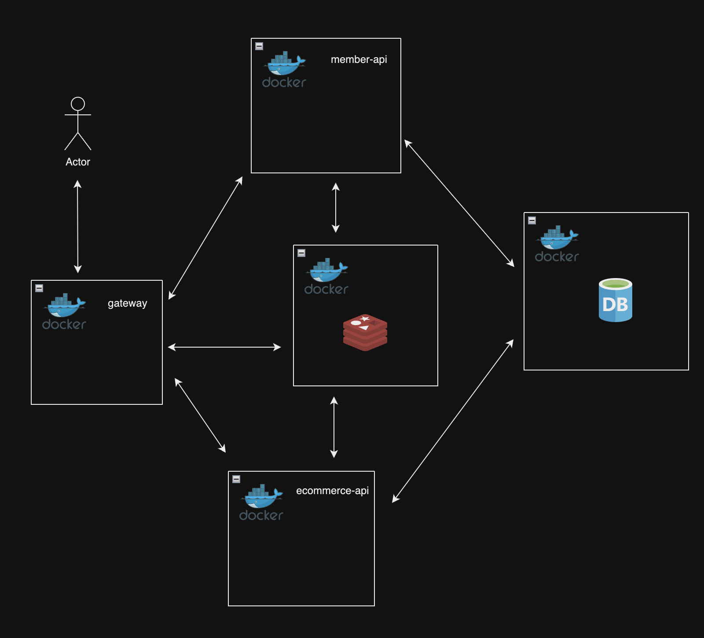

### 프로젝트 소개

이커머스 주문 하기를 구현하는 프로젝트 입니다.
이커머스에는 상품 관리, 회원 관리 등 여러 기능들이 있지만, 현 프로젝트는 트래픽이 발생하는 상황에서 '주문' 기능을 잘 수행할 수 있는
백엔드 개발을 중시했습니다.

데이터 정합성, 속도와 사용자 경험을 생각하며 주문 기능을 설계하고 구현했습니다. 
서버에 장애가 일어나는 상황을 생각하여 데이터 정홥성을 고려, 속도 관련 이슈를 해결하기 위해 nGrinder를 이용하여 근거를 찾았습니다.
해결 방법을 찾을 때는 사용자 경험을 고려하며 trade off를 고려했습니다.

### 트래픽의 개략적인 측정

목표 트래픽(TPS)을 설정하기 위해 Active User 수가 필요했기에 기준이 필요하다.
MAU를 기준으로 MAU 1만으로 하겠다.
DAU는 MAU / 30 으로 333입니다.
하지만 본 프로젝트는 학습에 중점을 두기에 DAU 목표치는 300으로 설정했습니다.

TPS를 구하기 위해 평균 응답 시간이 필요했습니다. 평균 응답 시간은 0.8s로 설정했습니다.
<a href='https://web.dev/articles/ttfb?hl=ko#what-is-a-good-ttfb-score' target='_blank' >web.dev</a>에 의하면 0.8초 이내의 평균
응답 시간이 사용자에게 좋은 경험을 줄 수 있는 시간이기에 선택했습니다.
Active user가 300명, 0.8초의 MTT 일 때, TPS는 375 입니다.
이에 현 테스트는 TPS 375를 목표로 합니다.

### 서버 인프라 구성

프로젝트를 하며 구축하게 된 인프라 구성입니다. 테스트 환경을 어떻게 구축했고 어떤 이슈가 있었는지 앞으로 글에서 설명 드릴 것입니다.

