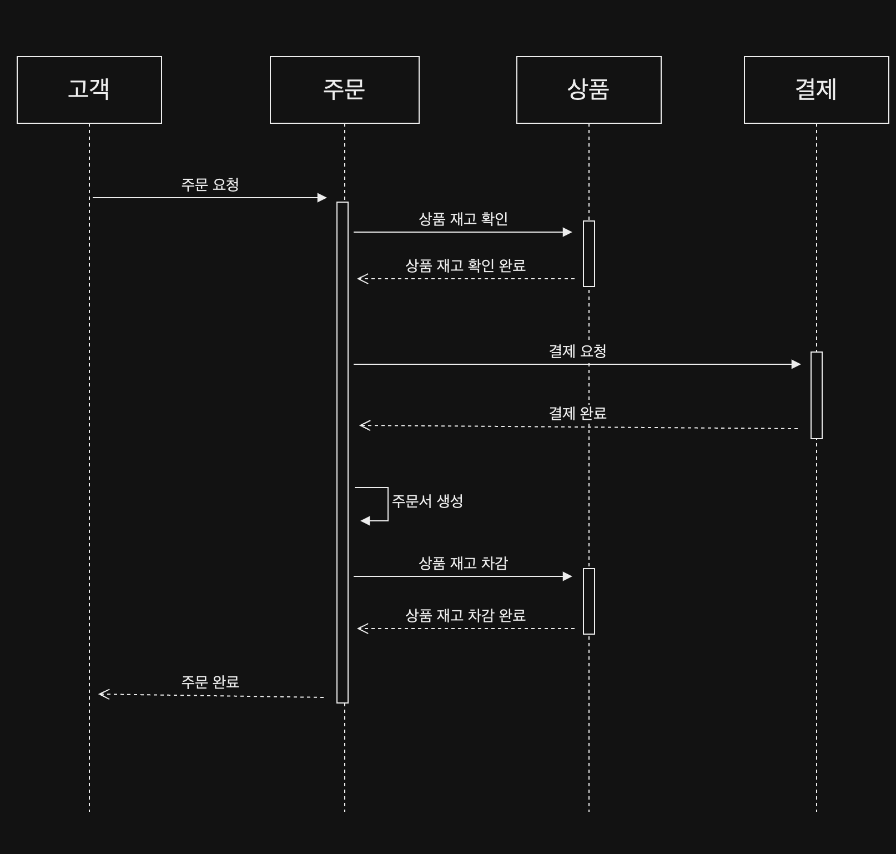

### 데이터 정합성

주문하기를 설계하면서 가장 신경 쓴 것은 데이터 정합성이다. 
이커머스에서 주문하기는 매우 중요합니다. 결제 후 주문서가 생성이 안 될수 있고,
주문서 생성 후 상품 재고가 차감 안 될수도 있습니다. 이런 상황은 서버가 다운되는 상황에서 대표적으로 일어납니다.

서버가 다운되더라도 트랜잭션에 의존한다면 ACID로 인해 결제, 주문서 생성, 상품 재고 차감 등 모두 안되거나, 모두 되거나 하는 상황을 만들 수 있습니다.
하지만 MSA로 구성하였기에 서로 다른 서비스의 트랜잭션을 관리해야 합니다.
서비스가 서로 어떤 DB를 쓰는지 모르기 때문에 서로 다른 서버에 있는 트랜잭션을 관리해야 합니다.

### 서버가 다운 된다면?

#### 주문하기 시퀀스 다이어 그램

<center></center>

위 다이어그램을 참고하여 다운 가능 지점을 확인 해보겠습니다.

#### 서버 다운 가능 지점


위 설계는 데이터 정합성 관련하여 많은 문제가 있습니다. 1, 2, 3, 4, 5, 6번에서 서버가 다운될 시 
결제는 되었지만 주문서가 생성이 않되는 상황, 주문서는 생성 되었지만 상품이 차감되지 않은 상황 등 여러 케이스가 존재합니다.
결국 사용자 입장에서 돈을 잃어 버리거나, 제대로 결제가 되었음에도 주문 내역에 주문서가 없는 상황에 놓이게 됩니다.

우선 이 문제를 단번에 해결할 수 있는 방법은 하나의 트랜잭션에서 모든 상황을 해결하는 것이다.
일단 하나의 트랜잭션으로 모든 로직을 처리할 수 있게 구현을 해보겠습니다.
그러면서 만나는 문제를 해결해 보겠습니다.

### 구현

```java
@Transactional
public String order(Long productId, int quantity, Long memberId, LocalDateTime now) {
    // 상품 재고 확인
    Product product = productRepository.getLockBy(productId);
    product.checkQuantity(quantity);

    // 결제하기
    BigDecimal totalPrice = product.getPrice().multiply(BigDecimal.valueOf(quantity));
    paymentRepository.payment(totalPrice);

    // 주문서 생성
    Order order = Order.builder()
            .memberId(memberId)
            .ordersCode(now.format(DateTimeFormatter.ofPattern("yyyyMMddHHmmssSSS")))
            .build();
    Order createOrder = orderRepository.save(order);

    OrderDetail orderDetail = OrderDetail.builder()
            .ordersId(createOrder.getId())
            .productId(productId)
            .quantity(quantity)
            .price(totalPrice)
            .status(OrderDetail.OrderStatus.COMPLETE)
            .build();
    orderDetailRepository.save(orderDetail);

    product.deducted(quantity);
    productRepository.save(product);

    return order.getOrdersCode();
}
```

### 추후 고민 사항
1. 동시성 때문에 발생하는 상품 재고 문제
2. 주문 코드 중복 생성 문제
